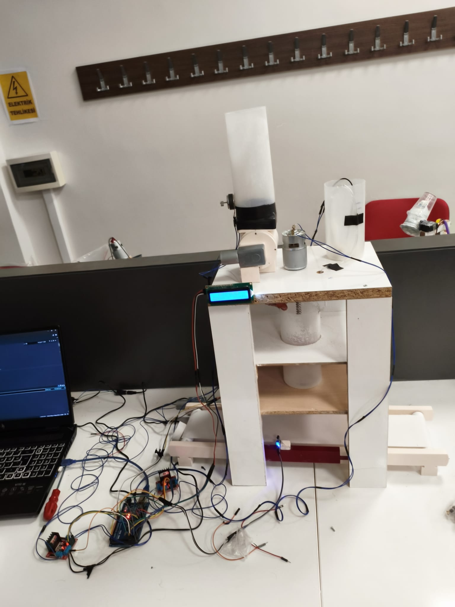
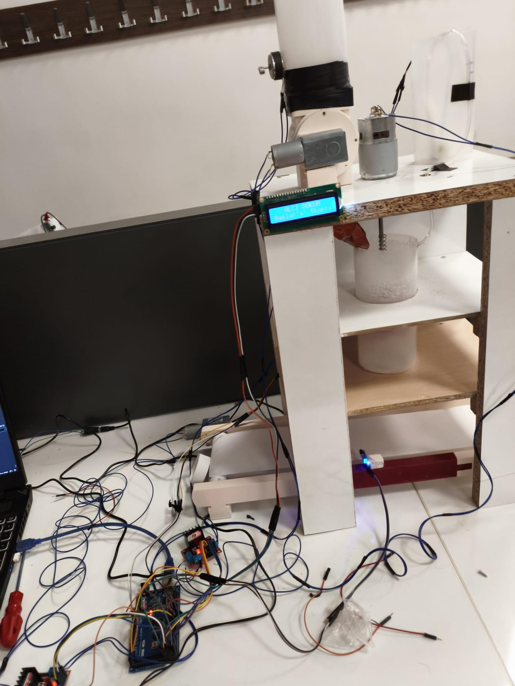

# 🏭 Alçı Dökme Makinesi Otomasyonu

Okul projem için Arduino Mega 2560 tabanlı, alçı karıştırma ve kalıba dökme işlemini tam otomatik olarak gerçekleştiren makine kontrol sistemi.

---

## 📋 İçindekiler

- [Genel Bakış](#genel-bakış)
- [Donanım](#donanım)
- [Devre Bağlantıları](#devre-bağlantıları)
- [Çalışma Sırası](#çalışma-sırası)
- [Kurulum](#kurulum)
- [Kullanım](#kullanım)
- [Özellikler](#özellikler)
- [Medya](#medya)

---

## Genel Bakış

Bu proje; dalgıç pompa, rötari valf, karıştırıcı, konveyör bant, servo kapak ve kızılötesi sensörden oluşan bir alçı dökme makinesini Arduino Mega 2560 ile kontrol eder. Sistem, su dolumu → karıştırma → kalıplara dökme adımlarını sırayla ve otomatik olarak yürütür.

---

## Donanım

| Bileşen | Adet | Açıklama |
|---|---|---|
| Arduino Mega 2560 | 1 | Ana mikrodenetleyici |
| L298N Motor Sürücü | 2 | DA motor kontrolü |
| 12V DA Motor | 3 | Rötari Valf, Karıştırıcı, Konveyör Bant |
| Dalgıç Pompa | 1 | Sıvı aktarımı |
| Servo Motor (MG996R) | 1 | Dağıtım kapağı |
| Kızılötesi Sensör | 1 | Kap algılama |
| 16x2 I2C Ekran | 1 | Durum ekranı |
| 12V Güç Adaptörü | 2 | Motor kartları için |
| Bilgisayar / USB | 1 | Arduino güç kaynağı + seri haberleşme |

---

## Devre Bağlantıları

### L298N #1 — Konveyör Bant + Rötari Valf

| L298N #1 | Arduino Mega |
|---|---|
| GİRİŞ 1 | Pin 22 |
| GİRİŞ 2 | Pin 23 |
| ENA | Pin 2 (PWM) |
| GİRİŞ 3 | Pin 24 |
| GİRİŞ 4 | Pin 25 |
| ENB | Pin 3 (PWM) |
| 12V | GK #1 (+) |
| GND | GK #1 (−) + Arduino GND |

- **ÇIKIŞ 1 / ÇIKIŞ 2** → Konveyör Bandın DA Motoru
- **ÇIKIŞ 3 / ÇIKIŞ 4** → Rötari Valfin DA Motoru

---

### L298N #2 — Karıştırıcı + Dalgıç Pompa

| L298N #2 | Arduino Mega |
|---|---|
| GİRİŞ 1 | Pin 26 |
| GİRİŞ 2 | Pin 27 |
| ENA | Pin 4 (PWM) |
| GİRİŞ 3 | Pin 28 |
| GİRİŞ 4 | Pin 29 |
| ENB | Pin 5 (PWM) |
| 12V | GK #2 (+) |
| GND | GK #2 (−) + Arduino GND |

- **ÇIKIŞ 1 / ÇIKIŞ 2** → Karıştırıcının DA Motoru
- **ÇIKIŞ 3 / ÇIKIŞ 4** → Dalgıç Pompa

---

### Servo Motor (MG996R)

| Kablo | Bağlantı |
|---|---|
| Kahverengi (Toprak) | Arduino GND |
| Kırmızı (Güç) | Arduino 5V |
| Turuncu (İşaret) | Arduino Pin 8 |

---

### Kızılötesi Sensör

| Kızılötesi Sensör | Bağlantı |
|---|---|
| Güç | Arduino 5V |
| Toprak | Arduino GND |
| Çıkış | Arduino Pin 30 |

---

### 16x2 I2C Ekran (Adres: 0x27)

| Ekran | Bağlantı |
|---|---|
| Güç | Arduino 5V |
| Toprak | Arduino GND |
| SDA | Arduino Pin 20 |
| SCL | Arduino Pin 21 |

---

### Acil Durdurma Butonu

| Buton | Bağlantı |
|---|---|
| Bir ucu | Arduino Pin 18 (Kesme 1) |
| Diğer ucu | Toprak |

---

## Çalışma Sırası

```
[BAŞLATMA KOMUTU]
   │
   ▼
Dalgıç Pompa — 35 sn çalışır (suyun karıştırma kabına aktarımı)
   │
   ▼
Rötari Valf — 8 sn çalışır (alçının karıştırma kabına aktarımı)
   │
   ▼
Karıştırıcı Motor — 10 sn çalışır
   │
   ▼
Konveyör Bant çalışır → Kızılötesi Sensör Kap #1'i algılar
   │
   ▼
Bant durur (3 sn) → Servo 110° açılır → 1 sn sonra kapanır
   │
   ▼
Konveyör Bant çalışır → Kızılötesi Sensör Kap #2'yi algılar
   │
   ▼
Bant durur (3 sn) → Servo 110° açılır → 1 sn sonra kapanır
   │
   ▼
Son bant hareketi — 3 sn
   │
   ▼
[TAMAMLANDI]
```

---

## Hız Ayarları

| Motor | Genişlik Ayarı (0-255) | Oran |
|---|---|---|
| Dalgıç Pompa | 191 | %75 |
| Rötari | 255 | %100 (tam hız) |
| Karıştırıcı | 191 | %75 |
| Konveyör Bant | 191 | %75 |

> Rötari tam hızda doğrudan HIGH sinyaliyle sürülür, Servo kütüphanesiyle zamanlayıcı çakışmasını önlemek için darbe genişliği yerine `digitalWrite(HIGH)` tercih edilir.

---

## Kurulum

### Gerekli Kütüphaneler

Arduino IDE'ye aşağıdaki kütüphaneleri yükleyin:

- `LiquidCrystal_I2C` — Frank de Brabander
- `Servo` — Arduino (yerleşik)
- `Wire` — Arduino (yerleşik)

### Adımlar

1. Bu depoyu klonlayın:
   ```bash
   git clone https://github.com/syaltha0/alci-karistirma-ve-aktarma-makinesi.git
   ```
2. `alci_dokum_otomasyon.ino` dosyasını Arduino IDE ile açın.
3. Kütüphaneleri yükleyin.
4. **Araçlar → Kart:** `Arduino Mega or Mega 2560` seçin.
5. Doğru seri portu seçin ve yükleyin.

---

## Kullanım

Kodu yükledikten sonra Arduino'yu bilgisayara bağlı bırakın ve **Seri Ekran**ı açın (9600 baud):

| Komut | Açıklama |
|---|---|
| `s` | Sistemi başlat |
| `t` | Kızılötesi sensör testi |
| `x` | Acil durdurma |
| `r` | Acil durdurma sonrası sıfırla |

Ekranda aktif aşama adı, kalan süre ve ilerleme çubuğu görüntülenir.

---

## Özellikler

- **Tam otomasyon:** Pompa → Karıştırma → Dağıtım sırası tek komutla çalışır
- **Acil durdurma:** Hem donanım butonu (Pin 18, kesme) hem seri `x` komutu ile anlık durdurma
- **Ekran ilerleme çubuğu:** Her aşama için gerçek zamanlı geri sayım ve doluluk çubuğu
- **Sensör zaman aşımı:** Kızılötesi sensör 20 saniye içinde kap algılamazsa uyarı mesajıyla devam eder
- **Titreşim giderme:** Kızılötesi sensör için yazılımsal titreşim giderme (15 ms)
- **Zamanlayıcı çakışması önlemi:** Rötari motoru Servo kütüphanesiyle aynı anda sorunsuz çalışır

---

## Medya

### Fotoğraflar

| | |
|---|---|
|  |  |

### Video

[](https://youtube.com/shorts/MHnwjVbow54)
